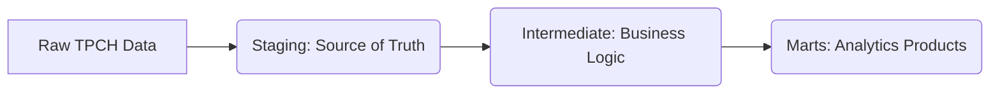

# Modern ELT Pipeline: DBT + Snowflake + Airflow Integration

This project demonstrates a **modern Enterprise-grade ELT (Extract, Load, Transform) pipeline** leveraging cutting-edge data stack principles. It focuses on extracting the **Snowflake TPCH sample dataset**, performing transformations using **dbt (data build tool)** with modular data modeling patterns and orchestrating the entire workflow with **Airflow** and the **Astronomer Cosmos library**.

## 🌟 Key Features
*   **End-to-End ELT Pipeline:** Illustrates a complete ELT process from data extraction to analytics-ready models.
*   **Snowflake Native Integration:** Utilizes Snowflake for **data warehousing** and uses the TPCH shared dataset, eliminating storage costs for the raw data.
*   **dbt for Transformations:** Employs **dbt Core** for **powerful and modular data transformations** , data modeling (including **staging tables**, **intermediate tables** and **data marts**) and **data quality testing**.
*   **Medallion Architecture:** Implements a **multi-layer transformation approach**:
    *   **Staging:** Provides source-aligned, raw data mirroring the `TPCH_SF1` dataset. These are materialized as **views**.
    *   **Intermediate:** Encapsulates **reusable business logic** and data aggregation.
    *   **Marts:** Creates **analytics-ready fact and dimension tables** for efficient querying and analysis. These are materialized as **tables**.
*   **Data Quality Tests**: dbt allows the definition of **generic tests** (built-in like `unique`, `not_null`, `relationships`, `accepted_values`) and **singular tests** (custom SQL queries) to ensure data quality at each transformation layer.
*   **Reusable Business Logic with Macros:** Demonstrates the use of **dbt macros** for encapsulating and reusing business logic (e.g., discounted amount calculations) across multiple models.
*   **Orchestration with Airflow and Cosmos:** Utilizes **Airflow** for robust pipeline scheduling and monitoring, simplified by the **Astronomer Cosmos library** for running dbt projects as Airflow DAGs.
*   **Local Development with dbt Core:** The project is set up for local development using **dbt Core**, installed via pip and used in a virtual environment.
*   **Snowflake Environment Setup:** Includes examples of setting up necessary Snowflake components such as **warehouses**, **databases**, **roles**, and **schemas**.
*   **CI/CD Ready:** Features a **containerized Airflow environment** (via Dockerfile) with dependency management.

## 🛠️ Core Technologies
| Component       | Tools                          | Purpose                          |
|-----------------|--------------------------------|----------------------------------|
| **Extract/Load**| Snowflake TPCH_SF1 dataset     | Raw data ingestion               |
| **Transform**   | dbt Core                       | Modeling, macros, data quality   |
| **Orchestrate** | Airflow + Cosmos library       | Pipeline scheduling/monitoring   |
| **Storage**     | Snowflake Warehouse (X-Small)  | Scalable cloud data storage      |

## 🛠️ Core Components Deep Dive

### Extract/Load Layer
*   **Snowflake TPCH_SF1 Dataset:** A pre-loaded transactional dataset within Snowflake, simulating supply chain operations with over 6 million rows, readily available for use.

### Transformation Layer Deep Dive
This layer is powered by **dbt**, following a **medallion architecture** to progressively refine the raw data:

#### Transformation Philosophy

- Staging Models: These dbt models directly select data from the Snowflake source tables (e.g.: orders, lineitem) and perform basic renaming and type casting. They serve as a clean and faithful representation of the source data. Views are commonly used for staging tables.

- Intermediate Models: These models apply business logic and transformations, often aggregating or joining data from the staging models. They help in creating more business-centric views of the data and in reusing complex logic. dbt's ref function is used to reference other models in the dbt project.

- Mart Models (Fact and Dimension Tables): These are the final layer of transformation, creating fact tables (containing numeric measures from business processes) and dimension tables (providing context to the facts). The example includes a fct_orders fact table joined with intermediate summaries. Surrogate keys are generated in staging and intermediate layers to facilitate joining fact and dimension tables.

##### Data Quality

- Generic Tests: Parameterized SQL queries (e.g., unique, not_null, relationships, accepted_values) defined in YAML files (.yml) to enforce data quality rules.

- Singular Tests: Custom SQL queries written to identify specific data quality issues (e.g.: checking for negative discounts or invalid dates).

##### Orchestration

- Airflow DAG with Cosmos: The project demonstrates how to orchestrate the dbt transformations as an Airflow Directed Acyclic Graph (DAG) using the Astronomer Cosmos library. Cosmos simplifies the integration of dbt projects within Airflow. You need to define an Airflow connection to your Snowflake instance.

## 🚀 Getting Started

- Prerequisites:
  - A Snowflake account with the TPCH sample dataset enabled.
  - dbt Core installed locally (refer to dbt Labs website for installation instructions, using pip install dbt-core). Consider using a virtual environment.
  - Airflow and Astronomer CLI installed if you wish to run the orchestration part. Follow the instructions on the Astronomer documentation.
  - Docker for running the containerized Airflow environment.

- Snowflake Setup:

  - Create a warehouse (e.g.: DBT_WAREHOUSE), database (e.g.: DBT_DB), and role (e.g., DBT_ROLE) in Snowflake.
  - Grant necessary privileges to the role for the warehouse and database.
  - Assign the role to your Snowflake user.
  - Create a schema (e.g.: DBT_SCHEMA) within your database where dbt will create tables.

- dbt Project Initialization:

  - Initialize a dbt project using dbt init.
  - Configure your dbt profile to connect to your Snowflake account, specifying your account details (locator), user, password, role (DBT_ROLE), warehouse (DBT_WAREHOUSE), database (DBT_DB), and schema (dbt_schema or similar) in your profiles.yml file.

- Install dbt Dependencies:

  - Define any necessary dbt packages (e.g.: dbt-utils) in your packages.yml file.
  - Install the dependencies using dbt deps.

- Run dbt Models and Tests:

  - Execute your dbt models using dbt run.
  - Run your dbt tests to ensure data quality using dbt test.

- Airflow Orchestration (Optional):
  - Ensure you have the necessary dependencies in your requirements.txt file (astronomer-cosmos, apache-airflow-providers-snowflake).
  - Configure a Snowflake connection in your Airflow UI. Provide your Snowflake account, warehouse, database, role, user, and password.
  - Place your dbt project folder within the Airflow DAGs folder.
  - Unpause and trigger the dbt DAG in Airflow.

This project illustrates the data flow through the different stages of the ELT pipeline, highlighting the central role of dbt for data transformation within Snowflake and the orchestration of this process by Airflow. The transformations are organized into layers (staging, intermediate, marts) for better modularity and maintainability.

